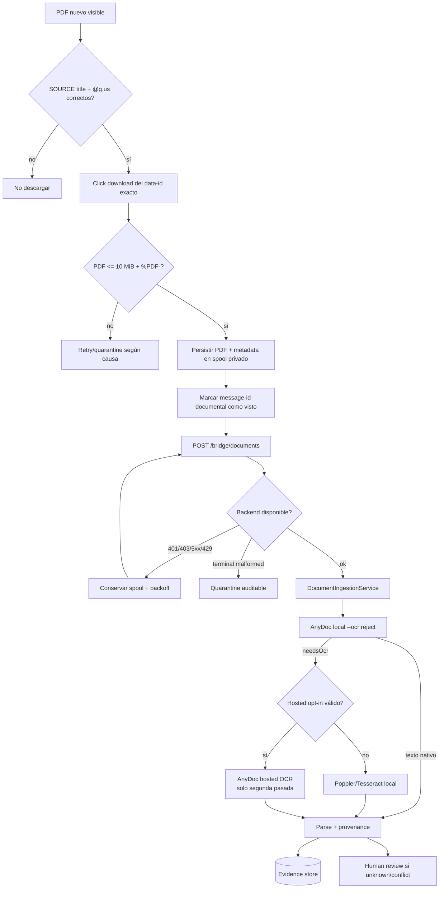
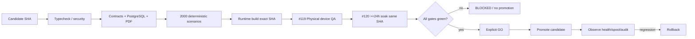

# Control Hípico — AnyDoc, PDFs automáticos y Archify

Este runbook cubre instalación, configuración, pruebas, operación y rollback de la auto-ingesta de PDFs del grupo SOURCE y de los diagramas Archify. No sustituye los gates #119/#120 ni autoriza operaciones monetarias.

## 1. Qué hace la integración

- El WhatsApp Web Bridge sigue usando **una sola sesión oficial Chrome/Edge** y el grupo SOURCE continúa **read-only**.
- Al arrancar se crea un baseline de documentos visibles. Los PDFs históricos visibles **no se descargan automáticamente**.
- Un PDF nuevo del SOURCE debe superar nombre `.pdf`, identidad SOURCE pinneada, magic bytes `%PDF-` y máximo 10 MiB.
- Los bytes se guardan primero en `spool-documents/pending`; sólo después el ID del mensaje se persiste como visto.
- El Bridge envía el PDF por `POST /api/v1/hipico-bot/bridge/documents` con provenance, nunca con owner/authority suministrados por cliente.
- Backend deriva `HIPICO_BRIDGE_OWNER_ID`, fija `authority=group_evidence` y usa el motor documental canónico.
- AnyDoc `0.2.4` intenta conversión local con `--ocr reject`. Si necesita OCR, el fallback normal es Poppler/Tesseract local.
- Firecrawl hosted OCR sólo se usa si se habilita de forma explícita y existe una clave válida. Incluso entonces, un PDF nativo se procesa localmente primero.
- Todo resultado mantiene `financialAuthority=false`; un PDF no liquida, paga, acredita ni oficializa una carrera por sí mismo.

## 2. Arquitectura runtime

```mermaid
flowchart LR
  WA[WhatsApp SOURCE\nread-only] -->|mensajes/media| BR[Web Bridge\nmisma sesión Playwright]
  BR -->|eventos shadow| API[/api/v1/hipico-bot]
  BR -->|PDF validado| SP[(Spool PDF\nbounded + durable)]
  SP -->|POST application/pdf| PDFAPI[/bridge/documents]
  PDFAPI --> DOC[Document Engine\nprovenance + SHA-256]
  DOC -->|native first| AD[AnyDoc 0.2.4\nlocal]
  DOC -->|needs OCR| OCR[Poppler + Tesseract\nlocal fallback]
  DOC --> DB[(PostgreSQL\nevidence + audit)]
  API --> DOM[Canonical Hípico Domain]
  DOM --> DB
  DOM --> AG[Shadow Agents\nproposal only]
  AG --> OP[Operator PWA\nhandoff/review]
  OP --> API
```

Fuente Archify: `docs/hipico/architecture/control-hipico-runtime.architecture.json`.

## 3. Flujo documental



Fuente Archify: `docs/hipico/architecture/control-hipico-document-ingestion.dataflow.json`.

## 4. Instalación local/servidor

Requisitos: Node 22, npm, PostgreSQL del backend, Chrome o Edge para el Bridge. Para OCR local instalar también Poppler y Tesseract.

Desde la raíz:

```bash
npm ci
npm run hipico:anydoc:install
```

El instalador crea `.tools/hipico-anydoc`, instala exactamente `@firecrawl/anydoc@0.2.4` y falla si `anydoc --version` no devuelve `0.2.4`. `.tools/` está ignorado por Git.

Linux Debian/Ubuntu para OCR local:

```bash
sudo apt-get update
sudo apt-get install -y --no-install-recommends poppler-utils tesseract-ocr
```

Comprobar AnyDoc:

```bash
.tools/hipico-anydoc/node_modules/.bin/anydoc --version
# esperado: 0.2.4
```

En Windows el binario queda en `.tools\hipico-anydoc\node_modules\.bin\anydoc.cmd` y el backend lo autodetecta.

## 5. Configuración backend

Copiar `backend/.env.example` a `backend/.env` y completar, como mínimo para el flujo Hípico:

```dotenv
HIPICO_GROUP_BRIDGE_TOKEN=<secreto aleatorio >=32 bytes>
HIPICO_BRIDGE_OWNER_ID=<UUID real del tenant/owner Hípico>
HIPICO_OWNER_ID=<UUID real usado por endpoints operador>
HIPICO_SOURCE_GROUP_ID=<SOURCE real @g.us>
HIPICO_LAB_GROUP_ID=<LAB real @g.us>
HIPICO_SOURCE_CHANNEL_KEY=club-hipico-triple-crown-official
HIPICO_OFFICIAL_SOURCE_CHANNEL_KEY=club-hipico-triple-crown-official
HIPICO_LAB_CHANNEL_KEY=control-hipico-lab
HIPICO_DOCUMENT_ANYDOC_HOSTED_OCR_ENABLED=false
FIRECRAWL_API_KEY=
```

El token y los IDs deben coincidir con los del Bridge. `HIPICO_BRIDGE_OWNER_ID` no se envía desde el navegador ni desde WhatsApp.

### Hosted OCR opcional

Mantenerlo **false** salvo decisión explícita de privacidad/operación. Para habilitarlo:

```dotenv
HIPICO_DOCUMENT_ANYDOC_HOSTED_OCR_ENABLED=true
FIRECRAWL_API_KEY=<secreto Firecrawl>
```

El adapter sigue haciendo primero una conversión local sin exponer la clave. Sólo `needsOcr` activa la segunda pasada hospedada.

## 6. Configuración del WhatsApp Web Bridge

En `tools/hipico-whatsapp-web-bridge` copiar `.env.example` a `.env` y completar:

```dotenv
HIPICO_RUNTIME_MODE=production
HIPICO_BACKEND_SYNC_ENABLED=true
HIPICO_INGEST_URL=https://<backend>/api/v1/hipico-bot/bridge/events
HIPICO_BRIDGE_HEALTH_URL=https://<backend>/api/v1/hipico-bot/bridge/health
HIPICO_DOCUMENT_INGEST_URL=https://<backend>/api/v1/hipico-bot/bridge/documents
HIPICO_GROUP_BRIDGE_TOKEN=<mismo secreto backend>
HIPICO_SOURCE_GROUP_ID=<SOURCE real @g.us>
HIPICO_LAB_GROUP_ID=<LAB real @g.us>
HIPICO_SOURCE_CHANNEL_KEY=club-hipico-triple-crown-official
HIPICO_LAB_CHANNEL_KEY=control-hipico-lab
HIPICO_REQUIRE_PINNED_GROUP_IDS=true
HIPICO_PDF_AUTO_INGEST_ENABLED=true
HIPICO_PDF_SPOOL_MAX_DOCUMENTS=50
HIPICO_SOURCE_BASELINE_IGNORE_HISTORY=true
HIPICO_LAB_SEND_ENABLED=false
```

No poner `HIPICO_SOURCE_BASELINE_IGNORE_HISTORY=false` con auto-PDF: la validación de producción lo rechaza para evitar descargas masivas de historial visible.

## 7. Primer arranque seguro

1. Ejecutar QA estática del Bridge:

```bash
npm run qa:hipico:bridge
```

2. Ejecutar preflight de producción:

```bash
cd tools/hipico-whatsapp-web-bridge
npm run production:check
```

3. Capturar/verificar IDs de grupos si aún no están pinneados:

```bash
npm run capture:groups
```

4. Mantener `HIPICO_LAB_SEND_ENABLED=false` durante la primera observación.
5. Arrancar:

```bash
npm run start
```

6. Vincular WhatsApp Web mediante el QR si el perfil aún no está vinculado.
7. Verificar que el Bridge muestra SOURCE activo correcto y nunca ofrece una ruta de envío al SOURCE.
8. Enviar/subir **un PDF de prueba nuevo** al grupo autorizado durante una ventana controlada.
9. Comprobar `data/document-health.json` y `data/spool-documents/`.
10. Consultar el documento en la API/operador y verificar provenance, clasificación y `financialAuthority=false`.

## 8. Estados del spool documental

- `pending`: bytes seguros en disco, entrega pendiente/retryable.
- `quarantine`: evidencia inválida o fallo terminal; requiere revisión manual.
- Un 401/403 no destruye el archivo: permanece retryable para corregir token/configuración.
- Default máximo: 50 pendientes. Configurable entre 1 y 200 mediante `HIPICO_PDF_SPOOL_MAX_DOCUMENTS`.
- Si se alcanza el máximo, no se descargan nuevos PDFs hasta drenar el spool.

Nunca borrar `spool-documents` para “arreglar” un backlog sin revisar los documentos y la causa.

## 9. Pruebas recomendadas

```bash
npm run hipico:anydoc:install
npm run skills:check
npm run agent:gates -- --files backend/src/modules/hipico/document-engine.ts,tools/hipico-whatsapp-web-bridge/src/document-runtime-hook.mjs
npm run qa:hipico:bridge
npm run test:hipico
npm run typecheck
npm run build:backend
node --test tests/hipico_pdf_automation_2000_property.test.mjs
```

Para el motor de datos con PostgreSQL/Poppler/Tesseract reales usar el workflow `Hípico Data Engines #285-#287`.

## 10. Archify

Archify está pinneado por `tools/archify/manifest.json` a:

- tag: `v2.16.0`
- annotated tag SHA: `fe2c0da92389bb35e9d71a9c7ae000c1083f2c37`
- commit: `c826e6c3a7abad19c0f3cd1ca57207d54b1ad8de`
- release ZIP SHA-256: `4c59fa6557a2385beaaef8c7219cc414573acc9f0c30a932d5053b0b20689a46`

Instalar y generar diagramas:

```bash
npm run hipico:archify:install
npm run hipico:archify:doctor
```

`hipico:archify:install` clona el repo oficial, hace checkout detached del commit exacto y ejecuta `doctor`. No acepta silenciosamente otra revisión. `ARCHIFY_UPDATE_CHECK_DISABLED=1` se fuerza en el tooling.

`hipico:archify:doctor` valida y genera:

- `control-hipico-runtime.html`
- `control-hipico-document-ingestion.html`
- `control-hipico-release-gates.html`

El workflow `.github/workflows/hipico-architecture-docs.yml` repite esa validación sobre el candidate SHA y sube los HTML como artifact.

## 11. Workflow de promoción



Fuente Archify: `docs/hipico/architecture/control-hipico-release-gates.workflow.json`.

## 12. Agents y skills

Ejecutar antes de cambios relevantes:

```bash
npm run agent:gates -- --files <paths-modificados>
npm run skills:check
```

El dominio `control-hipico` es `critical` y exige el skill `contagest-hipico-safe-automation`. Sus hard gates incluyen SOURCE read-only, multi-group isolation, bridge replay, document security/provenance, provider failure, race idempotency, campaña 2000, build/SHA, #119, #120 y rollback.

Los agents pueden clasificar, correlacionar, resumir y proponer. No pueden liquidar dinero, autodeclarar resultados oficiales, ignorar takeover humano ni bajar gates.

## 13. ¿Está listo para producción?

Hay dos conceptos distintos:

- **Listo para pruebas controladas:** cuando typecheck/unit/build/Bridge/document/DB exact-SHA estén verdes y la configuración SOURCE/LAB esté pinneada. En ese punto puede comenzar #119 en entorno real aislado.
- **Listo para producción:** sólo después de #119 PASS, #120 PASS >=24h sobre el mismo SHA, workflows ejecutados realmente, deployed SHA comprobado y GO explícito.

Un workflow sin runner/steps es `BLOCKED_INFRASTRUCTURE`; un Vercel READY o un source review no sustituye esos gates.

## 14. Rollback

Para detener sólo PDFs automáticos sin apagar el Bridge:

```dotenv
HIPICO_PDF_AUTO_INGEST_ENABLED=false
```

Reiniciar el Bridge. No borrar el spool; los pendientes conservan evidencia.

Para detener cualquier envío LAB:

```dotenv
HIPICO_LAB_SEND_ENABLED=false
HIPICO_LAB_TEST_INPUT_ENABLED=false
```

Para deshabilitar hosted OCR:

```dotenv
HIPICO_DOCUMENT_ANYDOC_HOSTED_OCR_ENABLED=false
```

El extractor vuelve a local AnyDoc + Poppler/Tesseract. No se requiere migración destructiva.

Si una release completa se degrada, promover/volver al último deployment SHA verificado y conservar DB/evidence append-only; no borrar documentos ni eventos para simular un rollback limpio.
