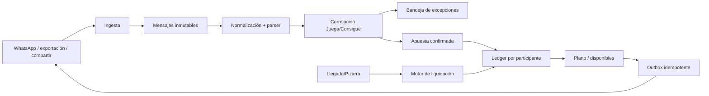

# Arquitectura v1.12

## Capas
- `frontend/public/hipico-control`: misma PWA utilizada como baseline del wrapper Android.
- IndexedDB: fuente local para continuidad sin cobertura y cola de cambios.
- Supabase: identidad, sincronización, mensajes, eventos, outbox, ledger y conciliación.
- Vercel Functions: webhook oficial, verificación criptográfica y envío server-side.
- Meta Cloud API: conector oficial cuando el canal/cuenta sea compatible y esté configurado.

## Estrategia sin conexión
El teléfono conserva captura y liquidación local. Si el bot cloud está configurado, su ejecución ocurre en Vercel/Supabase y no depende de que el teléfono del operador tenga cobertura. Si el canal de grupo no está disponible oficialmente, la entrada usa compartir/exportar/portapapeles hasta disponer de un conector aprobado.

## Compatibilidad
La migración v1.12 es aditiva. `hipico_workspaces` sigue existiendo para que v1.11 no quede inutilizable; las tablas relacionales nuevas se adoptan de forma gradual.
