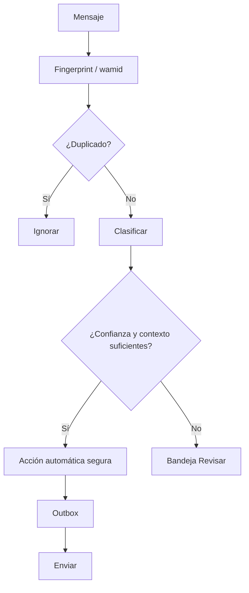

# Automatización de WhatsApp

## Meta oficial
El conector implementado usa el patrón de WhatsApp Business Platform Cloud API: verificación de webhook, firma `x-hub-signature-256`, recepción en backend, persistencia idempotente y outbox de envío. Los secretos son exclusivamente server-side.

La integración de grupos ordinarios no se da por supuesta. Antes de activar automatización de un grupo existente se debe verificar que la cuenta y el producto oficial de Meta soporten ese escenario. No se autoriza basar producción en automatizaciones de WhatsApp Web no oficiales que puedan romperse o arriesgar el número.

## Pipeline

## Respuestas
- Silencio para conversación normal.
- Acuse corto para solicitud válida cuando aporte valor.
- Contraoferta/confirmación actualiza la misma solicitud.
- Tras el cierre, las nuevas ofertas quedan fuera o en el siguiente bloque; nunca se mezclan automáticamente.
- La llegada cambia el estado a resultado recibido; la liquidación monetaria conserva un gate de revisión mientras el sistema no alcance historial suficiente de cero discrepancias.
- Saldo individual se responde preferiblemente al participante, no saturando el grupo.

## Idempotencia
Prioridad: `wamid` oficial. Fallback para chat exportado: hash de grupo + remitente + hora + texto normalizado + cita. La outbox tiene una `idempotency_key` independiente para impedir dobles respuestas tras reintentos.
