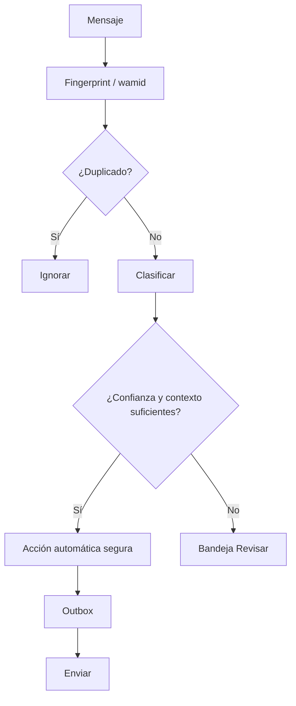

# Automatización de WhatsApp

## Meta oficial
El conector implementado usa el patrón de WhatsApp Business Platform Cloud API: verificación de webhook, firma `x-hub-signature-256`, recepción en backend, persistencia idempotente y outbox de envío. Los secretos son exclusivamente server-side.

La integración de grupos ordinarios no se da por supuesta. Antes de activar automatización de un grupo existente se debe verificar que la cuenta y el producto oficial de Meta soporten ese escenario. No se autoriza basar producción en automatizaciones de WhatsApp Web no oficiales que puedan romperse o arriesgar el número.

## Pipeline

## Respuestas
- Silencio para conversación normal.
- Acuse corto para solicitud válida cuando aporte valor.
- Contraoferta/confirmación actualiza la misma solicitud.
- Tras el cierre, las nuevas ofertas quedan fuera o en el siguiente bloque; nunca se mezclan automáticamente.
- La llegada cambia el estado a resultado recibido; la liquidación monetaria conserva un gate de revisión mientras el sistema no alcance historial suficiente de cero discrepancias.
- Saldo individual se responde preferiblemente al participante, no saturando el grupo.

## Idempotencia
Prioridad: `wamid` oficial. Fallback para chat exportado: hash de grupo + remitente + hora + texto normalizado + cita. La outbox tiene una `idempotency_key` independiente para impedir dobles respuestas tras reintentos.

## Fase 3 · conversación autónoma en el grupo

El objetivo operativo es que **CONTROL HÍPICO responda por sí mismo en el grupo WhatsApp pinneado**. La intervención humana deja de ser el flujo normal y queda como último recurso para takeover explícito, seguridad o conversaciones que agotan las aclaraciones automáticas.

La autonomía conversacional y la autoridad de dominio son controles distintos. El bot puede responder, pedir datos faltantes, rechazar una solicitud inválida o reconocer una operación detectada sin que eso autorice modificar dinero, saldos, resultados ni estados de carrera. Esos efectos conservan sus gates deterministas y evidencia persistida.

El árbitro `hipico-autonomous-conversation-v1` produce únicamente `AUTO_REPLY | ASK_CLARIFICATION | SILENT | HUMAN_LAST_RESORT`. Jev continúa sin autoridad: cuando su readiness está verificada solo puede degradar una respuesta a aclaración ante un conflicto de seguridad fuerte; nunca puede convertir un plan no enviable en una respuesta ni habilitar una acción.

La entrega al grupo fuente usa exclusivamente una respuesta generada por el backend. `classifyLocal()` y el fallback local siguen limitados a observabilidad/LAB y no poseen ruta hacia SOURCE. Antes de enviar, el Bridge exige `HIPICO_SOURCE_AUTO_REPLY_ENABLED=true`, runtime de producción, backend activo y coincidencia exacta con `HIPICO_SOURCE_GROUP_ID`. La identidad se valida de nuevo justo antes y después del envío.

Cada respuesta se guarda primero en el spool durable `source-reply` y lleva un marcador idempotente `[CHBOT:…]`. Si el proceso cae después de pulsar enviar pero antes de actualizar la cola, el siguiente intento busca el marcador visible y considera la entrega satisfecha en vez de duplicarla. Un kill switch local puede detener nuevos envíos conservando la cola para recuperación.

La automatización por WhatsApp Web sigue siendo una integración de dispositivo vinculado dependiente del DOM de WhatsApp Web, no una garantía de API oficial para grupos. Por eso las verificaciones de identidad, spool, health, retries y kill switch son parte del contrato de producción y no deben retirarse para simplificar el flujo.
